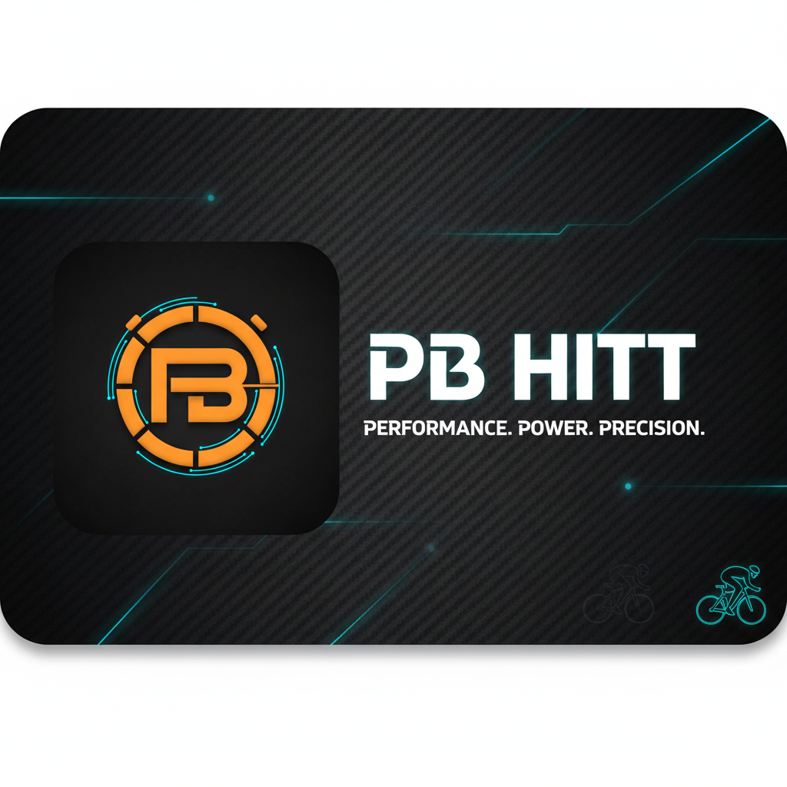

# 🏋️‍♂️ PB HIIT Timer

> **PWA de alta precisão para treinos HIIT com feedback de voz e rankings globais**

<div align="center">


---

### 📱 [Demo ao Vivo](#) • 📖 [Documentação Completa](./walkthrough.md)

</div>

<div align="center">
  
  
  <!-- Placeholder para Screenshot/GIF -->
  <!-- Adicione aqui uma captura de tela ou GIF demonstrando o timer em ação -->
  
</div>

---

## 🎯 Sobre o Projeto

**PB HIIT Timer** é um Progressive Web App (PWA) completo e sofisticado, desenvolvido especificamente para **treinos HIIT (High-Intensity Interval Training)** em bicicleta ergométrica. 

O projeto nasceu da necessidade de ter um timer **ultra-preciso** durante exercícios intensos, onde cada segundo conta. Diferente de apps genéricos, o PB HIIT oferece:

- ⏱️ **Motor de timer com correção de drift temporal** usando `Date.now()` para precisão absoluta
- 🔊 **Sistema de áudio imersivo** com Web Audio API (bips sintéticos) e Speech Synthesis (feedback de voz)
- 📱 **PWA instalável** - funciona como app nativo em mobile e desktop
- 🏆 **Gamificação social** com streak tracking, ranking global e biblioteca comunitária de treinos
- 🌓 **Interface adaptativa** com modo claro/escuro e elementos visuais grandes para visibilidade durante exercícios

Este projeto demonstra implementações avançadas de **React 19**, **TypeScript strict mode**, **Firebase Realtime Database**, **Web APIs modernas** e **design patterns** escaláveis.

---

## ✨ Principais Funcionalidades

### 🏃‍♂️ Sistema de Treino Inteligente

- **Timer de Alta Precisão**: Motor baseado em `Date.now()` com correção automática de drift, garantindo que 30 segundos sejam exatamente 30 segundos, independente da carga do navegador
- **Treinos Pré-configurados**: Tabata Clássico (20s/10s) e Sprints (30s/30s) prontos para usar
- **Builder Visual**: Crie treinos personalizados configurando:
  - 🔥 **Intensidade**: Leve, Moderada ou Pesada
  - ⚡ **RPM**: Cadência alvo (ex: 90 RPM)
  - 🪑 **Posição**: Sentado ou Em Pé
  - ⏳ **Fases**: Aquecimento, Trabalho, Descanso, Resfriamento
- **Edição e Publicação**: Salve, edite e compartilhe seus treinos com a comunidade

### 🔊 Áudio Imersivo e Feedback em Tempo Real

- **Modo Beep**: Tons sintéticos gerados via **Web Audio API** (OscillatorNode)
  - Bip grave (150 Hz) para contagem regressiva (3, 2, 1...)
  - Bip agudo (600 Hz) para transições de fase
- **Modo Voice**: Anúncios por voz usando **Speech Synthesis API**
  - "Aquecimento", "Tiro Máximo", "Descanso", "Resfriamento"
  - Contagem regressiva falada nos últimos 3 segundos
- **Modo Mute**: Silencioso completo

### 🌍 Social & Gamificação

- **Autenticação Google**: Login seguro via Firebase Authentication
- **Histórico com Calendário**: Visualize seus treinos em um calendário interativo
- **Streak Tracking**: Dias consecutivos de treino com cálculo inteligente
- **Ranking Global**: Compare-se com outros atletas em tempo real
  - Total de treinos completados
  - Tempo acumulado
  - Maior streak
- **Biblioteca Global**: Descubra e baixe treinos criados pela comunidade

### 🎨 Design e UX

- **Dark Mode/Light Mode**: Persistência de tema via localStorage
- **Display Gigante**: Timer com fonte de 9-12rem para máxima legibilidade
- **Cores Dinâmicas**: Interface muda de cor conforme intensidade do exercício
- **Responsivo**: Otimizado para mobile, tablet e desktop
- **PWA Instalável**: Adicione à tela inicial do celular/desktop

---

## 🛠️ Stack Tecnológico

### Core & Build

| Tecnologia | Versão | Uso |
|------------|--------|-----|
| **React** | 19.2.0 | Framework UI com Concurrent Features |
| **TypeScript** | 5.9.3 | Type safety com strict mode |
| **Vite** | 7.2.4 | Build tool ultrarrápido com HMR |
| **Tailwind CSS** | 4.1.17 | Utility-first CSS framework |

### Backend & Infrastructure

| Tecnologia | Versão | Uso |
|------------|--------|-----|
| **Firebase Auth** | 12.6.0 | Autenticação com Google OAuth |
| **Firestore** | 12.6.0 | Database NoSQL em tempo real |
| **React Router** | 7.9.6 | Navegação client-side |

### Web APIs

- **Web Audio API**: Geração de tons sintéticos para feedback sonoro
- **Speech Synthesis API**: Text-to-Speech para anúncios de voz
- **Web App Manifest**: PWA com ícones e standalone mode

---

## 🏗️ Arquitetura e Implementações Avançadas

Este projeto implementa padrões modernos de React e técnicas avançadas de desenvolvimento:

### ⚡ Timer com Correção de Drift Temporal

Diferente de timers baseados em `setInterval`, que acumulam imprecisões, o PB HIIT usa um algoritmo de **drift correction**:

```typescript
let expected = Date.now() + 1000;

const tick = () => {
    const drift = Date.now() - expected;
    expected += 1000;
    
    setTimeLeft(prev => prev - 1);
    
    timerRef.current = setTimeout(tick, Math.max(0, 1000 - drift));
};
```

**Resultado:** Precisão absoluta mesmo em dispositivos com alto uso de CPU.

### 🔥 Optimistic UI Updates

Atualizações de interface acontecem **antes** da confirmação do Firebase, proporcionando uma experiência instantânea:

```typescript
// UI atualiza imediatamente
setCustomPrograms([...customPrograms, newProgram]);

// Firebase sincroniza em background
await addDoc(collection(db, 'programs'), newProgram);
```

### 📡 Firestore Realtime Listeners

Uso de `onSnapshot()` para atualizações em tempo real sem polling:

```typescript
const unsubscribe = onSnapshot(
    query(collection(db, 'global-programs')), 
    (snapshot) => {
        const programs = snapshot.docs.map(doc => ({ 
            id: doc.id, 
            ...doc.data() 
        }));
        setGlobalPrograms(programs);
    }
);
```

**Impacto:** Ranking global atualiza instantaneamente quando qualquer usuário completa um treino.

### 🧩 Context API + Custom Hooks

Separação de concerns com múltiplos contextos especializados:

- **AuthContext**: Gerenciamento de autenticação e sessão
- **ThemeContext**: Controle de tema dark/light
- **DataContext**: CRUD de treinos e histórico com Firebase

Custom Hooks encapsulam lógica complexa:

- **useTimer**: 109 linhas de lógica de timer com drift correction
- **useAudio**: Abstração de Web Audio API e Speech Synthesis
- **useData**: Wrapper tipado para acesso ao DataContext

### 🔒 Type Safety com TypeScript

Interfaces e tipos rigorosos para todo o domínio:

```typescript
interface Interval {
    type: PhaseType;
    duration: number;
    name: string;
    intensity?: Intensity;
    rpm?: number;
    position?: Position;
}

interface Program {
    id: string;
    name: string;
    intervals: Interval[];
    totalTime: number;
    isCustom?: boolean;
    createdAt?: Timestamp;
    userId?: string;
}
```

---

## 📸 Pré-visualização

<div align="center">

### 🏠 Dashboard Principal
<!--  -->
*Placeholder: Capture do dashboard mostrando treinos pré-definidos e personalizados*

---

### 🛠️ Builder de Treinos
<!--  -->
*Placeholder: Interface do construtor de treinos com formulários de configuração*

---

### ⏱️ Tela de Treino Ativo (Dark Mode)
<!--  -->
*Placeholder: Timer gigante em execução com métricas de RPM e intensidade*

---

### 🌞 Tela de Treino Ativo (Light Mode)
<!--  -->
*Placeholder: Mesma tela em modo claro*

</div>

---

## 🚀 Instalação e Execução Local

### Pré-requisitos

- **Node.js** 18+ e **npm**
- Conta **Firebase** com projeto configurado
- Navegador moderno (Chrome, Firefox, Edge, Safari)

### Passo a Passo

#### 1️⃣ Clone o repositório

```bash
git clone https://github.com/danbuck84/pbhiit-timer.git
cd pbhiit-timer
```

#### 2️⃣ Instale as dependências

```bash
npm install
```

#### 3️⃣ Configure o Firebase

Crie um arquivo `.env.local` na raiz do projeto com suas credenciais Firebase:

```env
VITE_FIREBASE_API_KEY=sua_api_key_aqui
VITE_FIREBASE_AUTH_DOMAIN=seu_projeto.firebaseapp.com
VITE_FIREBASE_PROJECT_ID=seu_project_id
VITE_FIREBASE_STORAGE_BUCKET=seu_projeto.appspot.com
VITE_FIREBASE_MESSAGING_SENDER_ID=seu_sender_id
VITE_FIREBASE_APP_ID=seu_app_id
VITE_FIREBASE_MEASUREMENT_ID=seu_measurement_id
```

**Importante:** Habilite no Firebase Console:
- **Authentication** → Google Provider
- **Firestore Database** → Criar database em modo de produção

#### 4️⃣ Execute o servidor de desenvolvimento

```bash
npm run dev
```

Acesse: **http://localhost:5173**

#### 5️⃣ Build para produção

```bash
npm run build
```

Os arquivos otimizados estarão em `dist/`.

---

## 📂 Estrutura do Projeto

```
pbhiit-timer/
├── public/                    # Assets estáticos
│   ├── banner.png            # Banner do projeto
│   ├── favicon.ico           # Favicon
│   ├── main-logo.png         # Logo (512x512 para PWA)
│   └── manifest.json         # Manifest PWA
│
├── src/
│   ├── components/           # Componentes reutilizáveis
│   │   ├── Button.tsx        # Botão estilizado
│   │   ├── FixedHeader.tsx   # Header com logo e perfil
│   │   └── Layout.tsx        # Container de layout
│   │
│   ├── context/              # Context API (Estado Global)
│   │   ├── AuthContext.tsx   # Autenticação Firebase
│   │   ├── DataContext.tsx   # CRUD de treinos e histórico
│   │   └── ThemeContext.tsx  # Dark/Light mode
│   │
│   ├── hooks/                # Custom Hooks
│   │   ├── useTimer.ts       # Motor do timer com drift correction
│   │   ├── useAudio.ts       # Web Audio API + Speech Synthesis
│   │   └── useData.ts        # Wrapper para DataContext
│   │
│   ├── lib/                  # Utilitários e configurações
│   │   ├── firebase.ts       # Inicialização Firebase
│   │   └── utils.ts          # Funções auxiliares
│   │
│   ├── pages/                # Páginas da aplicação
│   │   ├── Login.tsx         # Tela de login com Google
│   │   ├── Home.tsx          # Dashboard principal
│   │   ├── Builder.tsx       # Construtor de treinos
│   │   ├── ActiveWorkout.tsx # Timer em execução
│   │   ├── History.tsx       # Histórico com calendário
│   │   ├── RankingPage.tsx   # Placar global
│   │   ├── Profile.tsx       # Perfil do usuário
│   │   ├── GlobalWorkouts.tsx # Treinos da comunidade
│   │   └── About.tsx         # Sobre o app
│   │
│   ├── types/                # Definições TypeScript
│   │   └── index.ts          # Interfaces e tipos
│   │
│   ├── App.tsx               # Componente raiz
│   ├── main.tsx              # Entry point
│   └── index.css             # Estilos globais (Tailwind)
│
├── package.json              # Dependências e scripts
├── vite.config.ts            # Configuração Vite
├── tsconfig.json             # Configuração TypeScript
└── tailwind.config.js        # Configuração Tailwind (v4)
```

### 📦 Principais Diretórios

- **`components/`**: Componentes de UI reutilizáveis e independentes
- **`context/`**: Providers de estado global usando React Context API
- **`hooks/`**: Lógica complexa encapsulada em custom hooks reutilizáveis
- **`pages/`**: Componentes de página com routing via estado local
- **`types/`**: Definições de tipos TypeScript para type safety

---

## 🧪 Scripts Disponíveis

```bash
npm run dev      # Servidor de desenvolvimento com Hot Module Replacement
npm run build    # Build otimizado para produção
npm run preview  # Preview do build de produção
npm run lint     # Executa ESLint
```

---

## 🚀 Deploy

### Netlify (Recomendado)

```bash
npm run build
```

Arraste a pasta `dist` para [Netlify Drop](https://app.netlify.com/drop) ou configure deploy automático via repositório GitHub.

**Configurações:**
- Build command: `npm run build`
- Publish directory: `dist`
- Adicione as variáveis de ambiente do Firebase no painel do Netlify

### Vercel

```bash
npm install -g vercel
vercel
```

### Firebase Hosting

```bash
firebase init hosting
firebase deploy
```

---

## 🎓 Aprendizados e Decisões Técnicas

### Por que React 19?

Aproveitamento de **Concurrent Features** e **Automatic Batching** para melhor performance em atualizações de timer de alta frequência.

### Por que Vite?

**Build ultrarrápido** (esbuild) e **HMR instantâneo**, crítico para desenvolvimento ágil com TypeScript e múltiplos componentes.

### Por que Firestore?

**Realtime listeners** nativos eliminam necessidade de polling, permitindo ranking global com latência mínima e sync automática.

### Por que Web Audio API?

**Controle total** sobre frequência, forma de onda e duração dos bips, permitindo criar feedback sonoro otimizado para cada fase do treino (grave para contagem, agudo para transição).

---

## 🔐 Segurança

### Firestore Security Rules Sugeridas

```javascript
rules_version = '2';
service cloud.firestore {
  match /databases/{database}/documents {
    // Usuários só acessam seus próprios programas
    match /users/{userId}/programs/{programId} {
      allow read, write: if request.auth != null && request.auth.uid == userId;
    }
    
    // Treinos globais são públicos para leitura
    match /global-programs/{programId} {
      allow read: if request.auth != null;
      allow create: if request.auth != null;
      allow update, delete: if request.auth.uid == resource.data.userId;
    }
  }
}
```

---

## 🗺️ Roadmap

- [ ] **Notificações Push** para lembretes de treino
- [ ] **Gráficos de Progresso** com Chart.js
- [ ] **Modo Offline** completo com Service Worker
- [ ] **Integração Bluetooth** com monitores cardíacos
- [ ] **Exportação CSV** do histórico
- [ ] **Sistema de Conquistas** (Badges)
- [ ] **Desafios entre Amigos**
- [ ] **Testes E2E** com Playwright

---

## 📄 Licença

Este projeto está licenciado sob a **MIT License** - veja o arquivo [LICENSE](LICENSE) para mais detalhes.

---

## 👤 Autor

**Dan Buck**  
📧 [Contato via GitHub](https://github.com/danbuck84)  
🔗 [LinkedIn](#) • [Portfolio](#)

---

## 🙏 Agradecimentos

- **React Team** pela incrível biblioteca e documentação
- **Vite** pela velocidade de desenvolvimento
- **Firebase** pela infraestrutura BaaS robusta
- **Tailwind CSS** pelo sistema de design produtivo
- **Lucide React** pelos ícones modernos e acessíveis

---

<div align="center">

**Desenvolvido com ❤️ e muitos treinos HIIT**

⭐ Se este projeto foi útil, considere dar uma estrela no GitHub!

</div>
